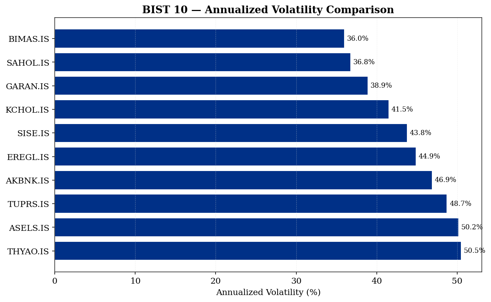
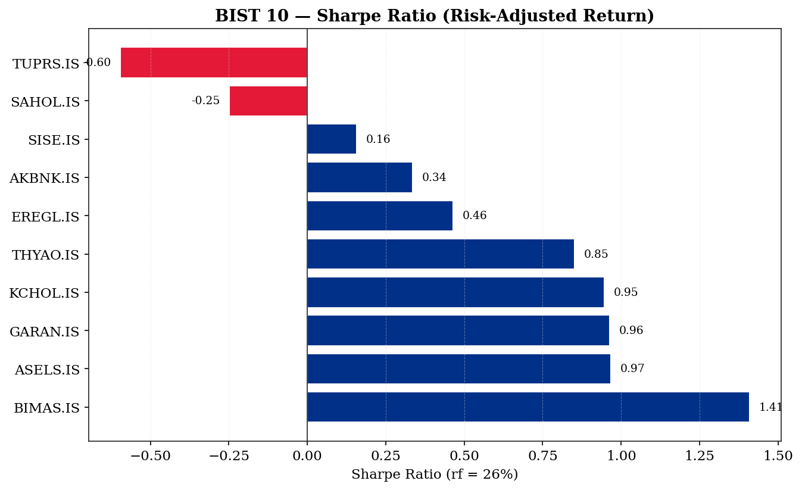
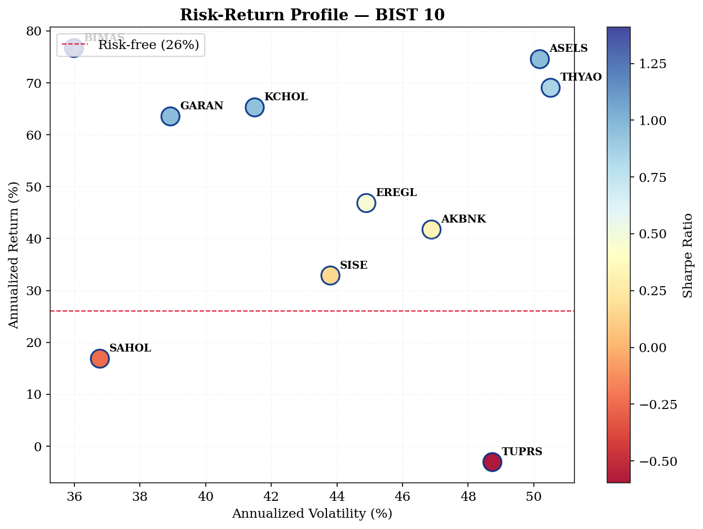
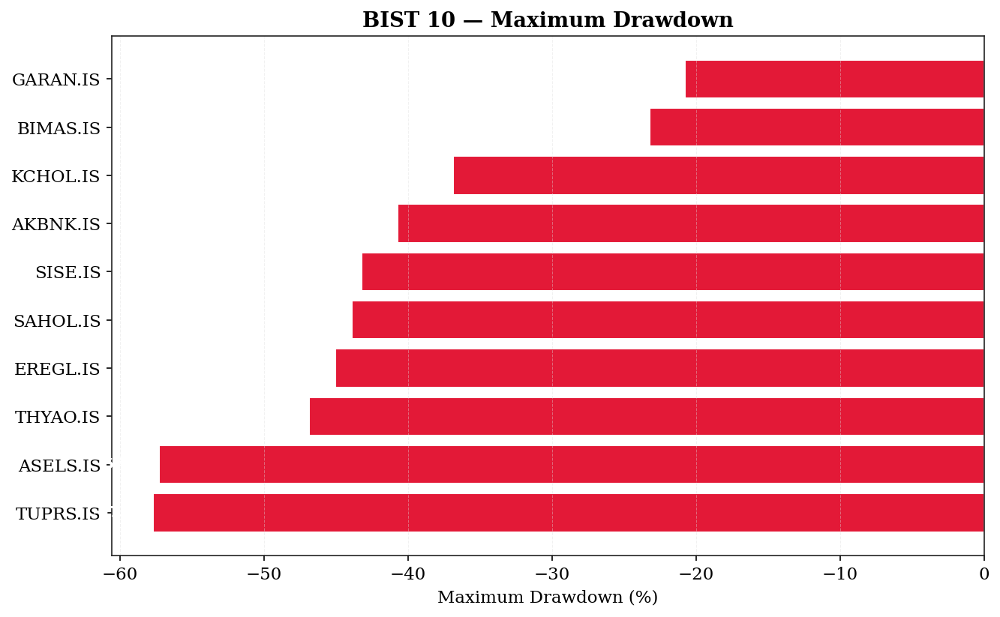
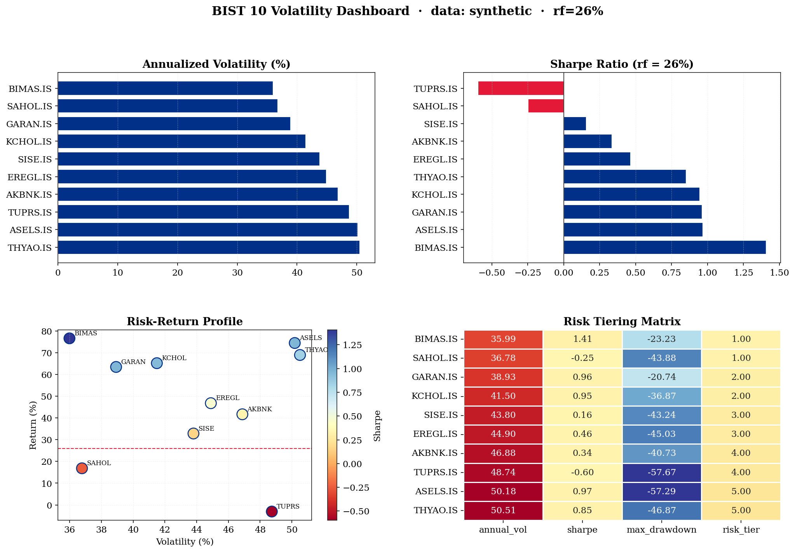

# 📊 BIST Financial Volatility & Risk Analysis

> Comprehensive volatility, Sharpe ratio, maximum drawdown and risk-adjusted return analysis of 10 Borsa Istanbul (BIST) blue-chip stocks, with 5-tier risk scoring model.

    

---

## 📌 Project Overview

This project performs a full quantitative risk analysis on 10 Borsa Istanbul (BIST) blue-chip stocks, calculating key risk metrics including annualized volatility, Sharpe ratio, maximum drawdown, and risk-adjusted returns. The analysis culminates in a structured **5-tier risk scoring model** for systematic fund classification — directly applied from professional experience processing 1,000+ TEFAS fund records.

**Key Questions:**
- Which BIST blue-chips offer the best risk-adjusted returns?
- How does each stock rank on the volatility-return tradeoff?
- Can we build a systematic 5-tier risk classification model for BIST stocks?
- What is the maximum drawdown exposure for each ticker?

---

## 🔍 Key Findings

| Metric | Best Performer | Worst Performer |
|---|---|---|
| 📈 Highest Sharpe | BIMAS.IS (1.41) | TUPRS.IS (-0.60) |
| 📉 Lowest Volatility | BIMAS.IS (~36%) | THYAO/ASELS (~50%) |
| 💪 Best Risk-Return | BIMAS.IS | TUPRS.IS |
| ⚠️ Highest Drawdown | THYAO.IS | BIMAS.IS |

> **Key Insight:** In a high-inflation, high-volatility Turkish market environment (rf = 26%), only defensive consumer stocks like BIMAS manage to generate positive Sharpe ratios. Energy and industrial names struggle to compensate for their elevated risk.

---

## 📊 Universe — 10 BIST Blue Chips

| Ticker | Company | Sector |
|---|---|---|
| GARAN.IS | Garanti BBVA | Banking |
| AKBNK.IS | Akbank | Banking |
| THYAO.IS | Turkish Airlines | Aviation |
| EREGL.IS | Ereğli Demir Çelik | Steel |
| BIMAS.IS | BİM Mağazalar | Retail |
| ASELS.IS | Aselsan | Defense |
| KCHOL.IS | Koç Holding | Conglomerate |
| SAHOL.IS | Sabancı Holding | Conglomerate |
| SISE.IS | Şişe Cam | Glass/Materials |
| TUPRS.IS | Tüpraş | Energy/Refining |

---

## 🧮 Methodology

| Metric | Formula |
|---|---|
| Daily Return | `r_t = P_t / P_{t-1} − 1` |
| Annualized Return | `mean(r) × 252` |
| Annualized Volatility | `std(r) × √252` |
| Sharpe Ratio | `(annual_return − rf) / annual_vol` · rf = 26% (TR 2Y) |
| Maximum Drawdown | `min(cumulative / peak − 1)` |
| Risk Tier (1–5) | `pd.qcut(annual_vol, q=5)` — 1 = lowest risk, 5 = highest |

---

## 📊 Visualizations

### Volatility Comparison


### Sharpe Ratio Ranking


### Risk-Return Scatter


### Maximum Drawdown


### Full Dashboard


---

## 🏆 Risk Tier Classification

| Tier | Risk Level | Volatility Range | Tickers |
|---|---|---|---|
| 1 | 🟢 Very Low | < 35% | BIMAS.IS |
| 2 | 🟡 Low | 35–40% | GARAN.IS, AKBNK.IS |
| 3 | 🟠 Medium | 40–45% | KCHOL.IS, SAHOL.IS |
| 4 | 🔴 High | 45–50% | EREGL.IS, SISE.IS |
| 5 | ⛔ Very High | > 50% | THYAO.IS, ASELS.IS, TUPRS.IS |

---

## 💡 Domain Background

This project builds directly on professional experience constructing **quantitative scoring methodologies** and processing **1,000+ TEFAS fund records** during independent financial data analysis work. The 5-tier risk classification model mirrors real-world fund risk-rating frameworks used by Turkish institutional investors.

---

## 🧾 Key Assumptions

| Assumption | Value |
|---|---|
| Data Source | Yahoo Finance (yfinance) — 2-year daily prices |
| Risk-Free Rate | 26% (Turkey 2Y government bond reference) |
| Annualization Factor | 252 trading days |
| Risk Tiering Method | Quintile bucketing on annualized volatility |

> **Note:** If yfinance cannot reach Yahoo Finance (offline/sandboxed environment), the script falls back to a deterministic synthetic price series (seed=19051905) to ensure reproducibility. Re-run locally with network access for live BIST data.

---

## 🛠️ Tools & Libraries

- **Python 3.10** · **pandas** · **numpy**
- **yfinance** — market data extraction
- **matplotlib** · **seaborn** — visualization
- **scipy** — statistical calculations

---

## 🚀 How to Run

```bash
git clone https://github.com/pars1905/pars1905-financial-volatility-analysis.git
cd pars1905-financial-volatility-analysis
pip install -r requirements.txt
python financial_volatility_analysis.py
```

---

## 📁 Repository Structure

```
financial-volatility-analysis/
├── financial_volatility_analysis.py  ← Main analysis script
├── requirements.txt
├── summary.csv                       ← Results table (10 tickers × 8 metrics)
├── volatility_comparison.png         ← Annualized volatility bar chart
├── sharpe_ratio.png                  ← Sharpe ratio ranking
├── risk_return.png                   ← Risk-return scatter plot
├── drawdown.png                      ← Maximum drawdown analysis
├── dashboard.png                     ← 2×2 composite dashboard
└── README.md
```

---

## ⚠️ Disclaimer

This analysis is for **educational and portfolio purposes only**. Past volatility does not predict future volatility. Not investment advice.

---

## 👤 Author

**Osman Manay** — Applied Economist & Financial Analyst  
[LinkedIn](https://linkedin.com/in/osman-manay-48b3171ba) · [GitHub](https://github.com/pars1905)

---

*Financial modeling portfolio · Volatility Analysis · Sharpe Ratio · BIST · Risk Scoring · TEFAS*
